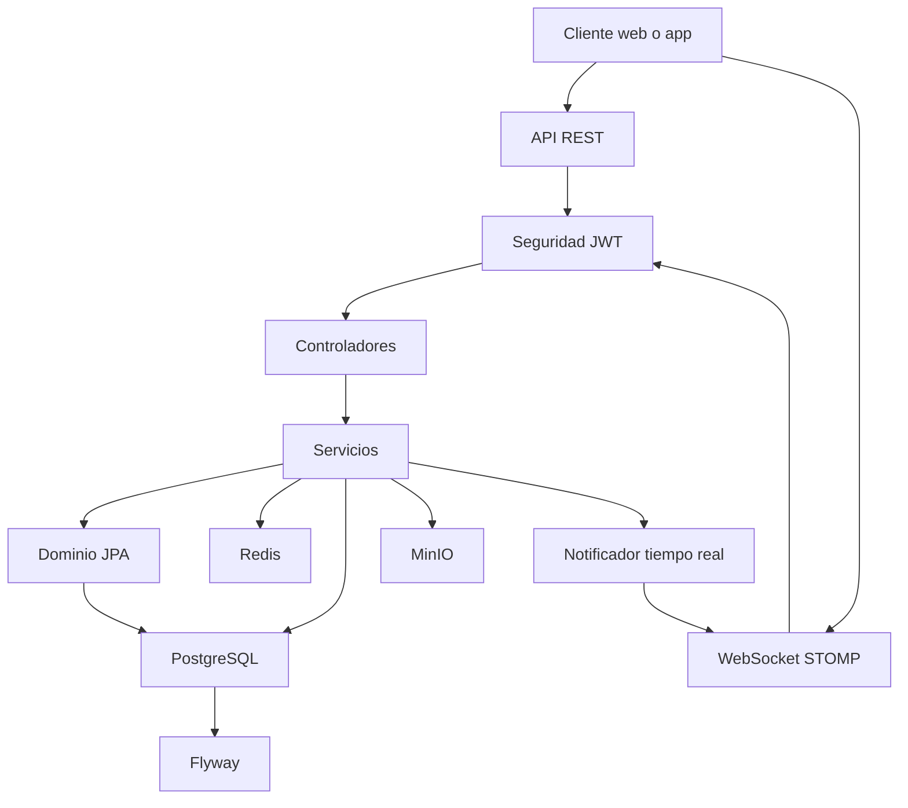
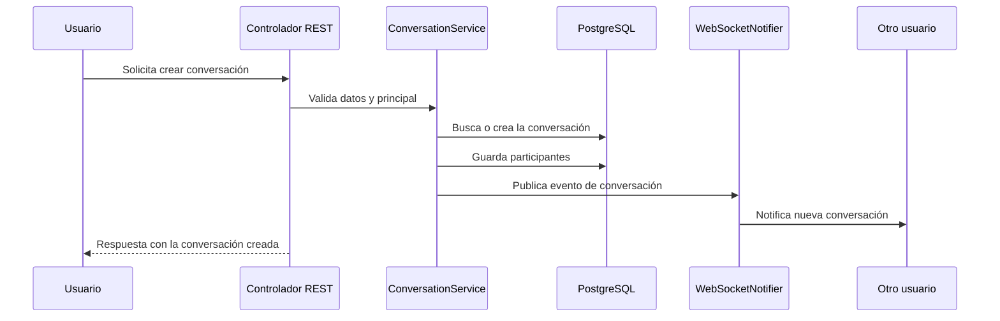
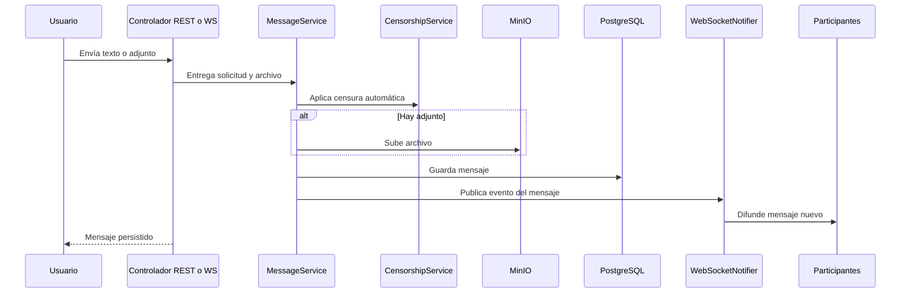
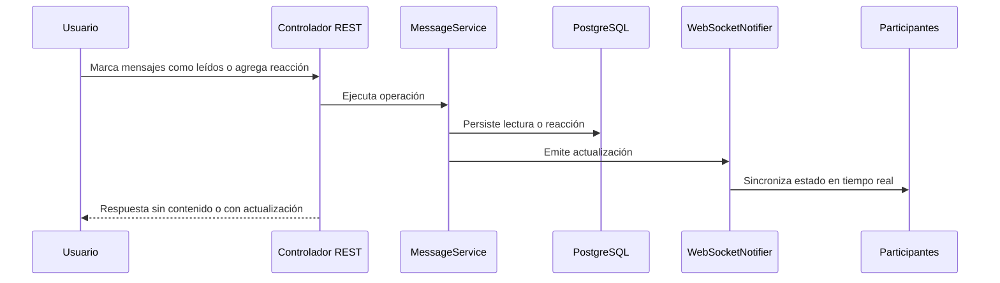

# AsclepioTalk

AsclepioTalk es el microservicio de chat del ecosistema Asclepio. Expone una API REST para gestionar conversaciones y mensajes, y un canal WebSocket para intercambio en tiempo real. El servicio se apoya en autenticación JWT, persistencia en PostgreSQL, cache en Redis, migraciones con Flyway y almacenamiento de adjuntos en MinIO.

## Resumen

El módulo concentra estas responsabilidades:

- Crear y administrar conversaciones individuales y grupales.
- Enviar, editar, borrar, fijar y censurar mensajes.
- Registrar lecturas y reacciones.
- Publicar eventos en tiempo real por WebSocket.
- Aplicar censura automática y manual sobre el contenido.
- Gestionar adjuntos de imagen y documento.
- Proteger la API con autenticación basada en JWT.

## Tecnologías

- Java 21
- Spring Boot
- Spring Web
- Spring Security
- Spring WebSocket
- Spring Data JPA
- Spring Data Redis
- Flyway
- PostgreSQL
- MinIO
- Lombok

## Arquitectura

## Funciones Principales

```mermaid
flowchart TB
    A[AsclepioTalk] --> B[Conversaciones]
    A --> C[Mensajes]
    A --> D[Censura]
    A --> E[Reacciones]
    A --> F[Lecturas]
    A --> G[Adjuntos]
    A --> H[Tiempo real]
    A --> I[Seguridad]

    B --> B1[Crear grupo o individual]
    B --> B2[Listar, ver, editar y borrar]
    B --> B3[Agregar o quitar participantes]

    C --> C1[Enviar texto]
    C --> C2[Enviar con adjunto]
    C --> C3[Editar, borrar y fijar]
    C --> C4[Responder a otro mensaje]

    D --> D1[Censura automática]
    D --> D2[Censura manual]
    D --> D3[Administrar palabras prohibidas]

    E --> E1[Agregar emoji]
    E --> E2[Quitar emoji]

    F --> F1[Marcar como leído]
    F --> F2[Notificar lectura]

    G --> G1[Subir archivo]
    G --> G2[Generar URL firmada]
    G --> G3[Descargar o visualizar]

    H --> H1[Typing]
    H --> H2[Mensaje nuevo]
    H --> H3[Lectura y cambios]

    I --> I1[JWT en HTTP]
    I --> I2[JWT en WebSocket]
    I --> I3[Roles y permisos]
```

## Flujos Principales

### Flujo de una nueva conversación

### Flujo de envío de mensaje

### Flujo de lectura y reacción

## Componentes Internos

- `ConversationController` y `ConversationService` administran la vida de las conversaciones.
- `MessageController` y `MessageService` gestionan mensajes, adjuntos, lecturas, fijados y censura.
- `CensorshipController` y `CensorshipService` controlan la lista de palabras prohibidas.
- `ChatWsController` recibe eventos de escritura y envío por WebSocket.
- `JwtAuthFilter`, `JwtValidator` y `SecurityConfig` protegen la comunicación.
- `MinioConfig` y `AttachmentStorageService` manejan el almacenamiento de archivos.
- `GlobalExceptionHandler` estandariza errores con respuestas claras.

## Persistencia

Flyway crea y mantiene el esquema base del módulo:

- Conversations y participantes
- Messages
- Censored words
- Read receipts
- Reactions
- Reply links
- Pinned messages
- Attachments

## Configuracion

La aplicación usa estas variables y valores base:

- Puerto del servicio: 3003
- Base de datos PostgreSQL con esquema talk
- Redis para cache de palabras censuradas
- MinIO para archivos adjuntos
- JWT para autenticación
- CORS habilitado para clientes locales

## Ejecucion local

- Instalar Java 21 y Maven.
- Levantar PostgreSQL, Redis y MinIO.
- Ejecutar migraciones con Flyway al iniciar la aplicación.
- Arrancar el servicio con `mvn spring-boot:run`.

## Notas Funcionales

- Las conversaciones individuales son idempotentes entre los mismos participantes.
- Los mensajes admiten texto, adjunto o ambos.
- La censura automática se aplica antes de persistir el mensaje.
- Los mensajes eliminados o censurados siguen respetando reglas de visibilidad por rol.
- Las lecturas y reacciones se sincronizan por WebSocket para mantener la interfaz actualizada.

## Resultado Esperado

El frontend obtiene un canal estable para chat médico en tiempo real con reglas de negocio centralizadas, auditoría de contenido, soporte de adjuntos y una capa de seguridad coherente con el resto de Asclepio.
